### Greetings and Salutations 👋🏾

<pre align="center">
<strong>Aaron Miller /</strong> <a href="https://www.aaronnathanmiller.net">Homepage</a> / <a href="https://www.reddit.com/user/afrodidact/submitted/?sort=top">Reddit</a> / <a href="https://github.com/afrodidact">GitHub</a> / <a href="https://gist.github.com/afrodidact">Gist</a> / <a href="https://stackoverflow.com/users/15118958/afrodidact">Stack Overflow</a> / <a href="https://www.credly.com/users/aaronnathanmiller/badges">Credly</a> / <a href="www.linkedin.com/in/aaronnathanmiller">LinkedIn</a></pre>

</img>

I am a cloud infrastructure associate at the Royal Opera House (London, England). Beside cloud computing, I am interested in autodidacticism, Emacs, and Mathematics. I am currently focused on growing my career through establishing healthy work-life balances to  sustain me in the longterm. 

<!--
**afrodidact/afrodidact** is a ✨ _special_ ✨ repository because its `README.md` (this file) appears on your GitHub profile.

Here are some ideas to get you started:

- 🔭 I’m currently working on ...
- 🌱 I’m currently learning ...
- 👯 I’m looking to collaborate on ...
- 🤔 I’m looking for help with ...
- 💬 Ask me about ...
- 📫 How to reach me: ...
- 😄 Pronouns: ...
- ⚡ Fun fact: ...
-->
